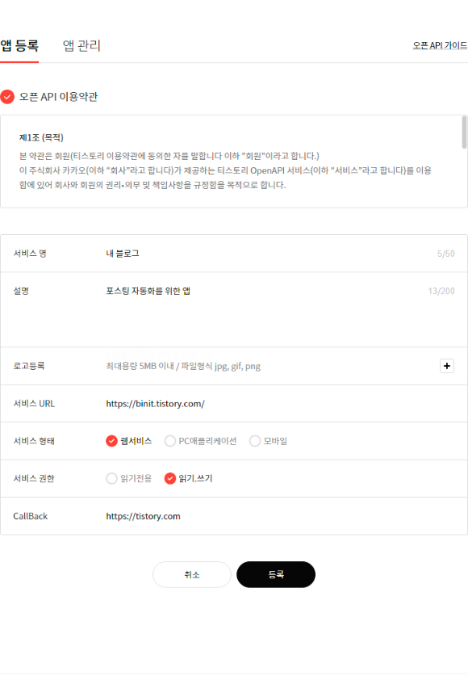
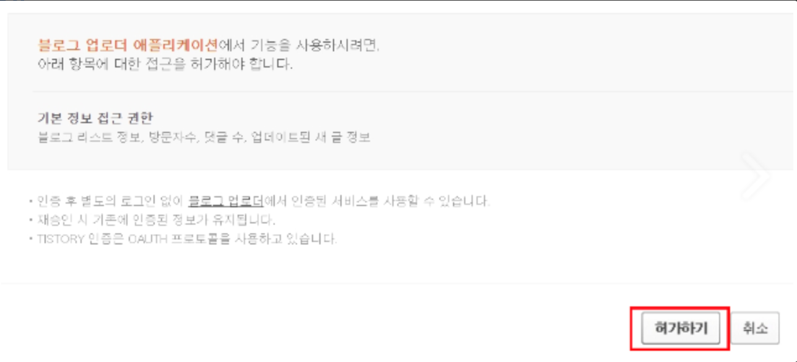

# 티스토리 포스트 머신

티스토리 API 관련 문서
https://tistory.github.io/document-tistory-apis/

## api 키 발급
1. tistory api key 발급
   - https://www.tistory.com/guide/api/manage/register
   -  

2. app key(client id) 확인
3. app secret 확인
4. app code 발급
   - https://www.tistory.com/oauth/authorize?client_id=APP_ID&redirect_uri=api키발급시작성한callback_url&response_type=code
   - 
   - redirected된 url에 code가 query parameter에 들어있음
5. access token 발급
   - https://www.tistory.com/oauth/access_token?client_id=APP_ID&client_secret=SECRET&redirect_uri=api키발급시작성한callback_url&code=api사용허가_후_받은_code의_값&grant_type=authorization_code
   - postman으로 요청시, access token 값 확인 가능, 또는 브라우저에 입력 후 개발자도구로 확인
   - Access token 값 확인 및 env파일에 저장

## 글쓰기
1. 글 쓰기 주제 입력
   - http://localhost:3000/write?category=Social&title=주식 투자의 기초
   - CHAT GPT가 블로그 글 생성, 결과 자동 포스팅 
